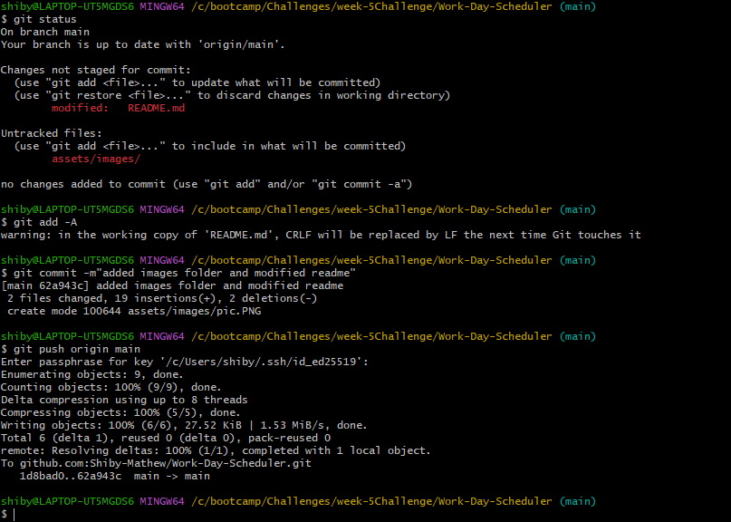
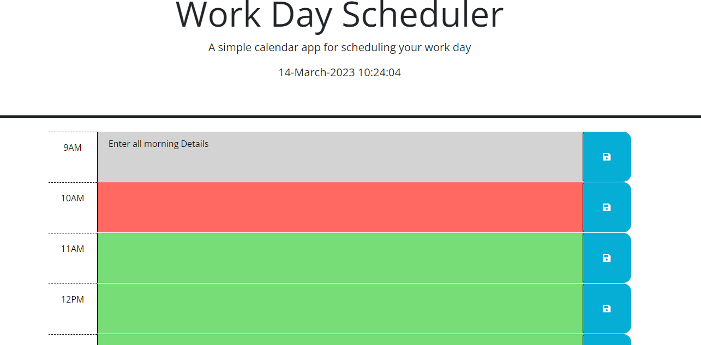

# Work-Day-Scheduler

```
The link for my deployed wesite can viewed here
https://shiby-mathew.github.io/Work-Day-Scheduler/

```

## Description

```md
A simple daily planner application that allows user to save events for each hour of the day
(9am-5pm). This app will run in the browser and it features dynamically updated HTML,CSS along with BootStrap powered by jQuery.I used Day.js to work with date and time.
```

## User Story

```md
AS AN employee with a busy schedule
I WANT to add important events to a daily planner
SO THAT I can manage my time effectively
```

## Acceptance Criteria

```md
GIVEN I am using a daily planner to create a schedule
WHEN I open the planner
THEN the current day is displayed at the top of the calendar
WHEN I scroll down
THEN I am presented with timeblocks for standard business hours
WHEN I view the timeblocks for that day
THEN each timeblock is color coded to indicate whether it is in the past, present, or future
WHEN I click into a timeblock
THEN I can enter an event
WHEN I click the save button for that timeblock
THEN the text for that event is saved in local storage
WHEN I refresh the page
THEN the saved events persist
```

## Code Snippet



## Mock-Up

The following is the image of this functionality:


